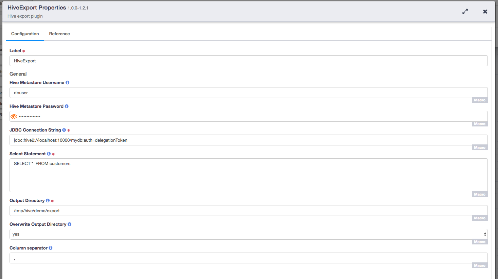

[](https://travis-ci.org/hydrator/hive-plugins) [](https://opensource.org/licenses/Apache-2.0)

Hive Export
===========

Hive Export will export data from hive table(s) and store them in csv format at a given directory location on HDFS.



Usage Notes
-----------

Hive Export will take select query as input to run that query on hive table and store results under provided HDFS directory. When the select query is provided to the plugin,
it converts that select query to [INSERT OVERWRITE DIRECTORY](https://cwiki.apache.org/confluence/display/Hive/LanguageManual+DML) hive statement.
When this query is executed, hive starts a mapreduce job which stores the results to provided directory location. So there can be multiple files in
a given directory location. Hive Export works with hive 1.2.1.

If any query other than a valid SELECT query is provided, Hive Export will fail to publish the pipeline. This is becuase we use [Apache Calcite](https://calcite.apache.org/)
to parse the SELECT query to verify that its not any other SQL Query.

To run the SELECT query, if `Overwrite Output Directory` property is set to `no`, the pipeline publish will fail if the output directory already exists. In that case,
please either remove the directory or allow directory to be overwritten by specifying `Overwrite Output Directory` property to `yes`.

Plugin Configuration
---------------------

| Configuration | Required | Default | Description |
| :------------ | :------: | :----- | :---------- |
| **Hive Metastore Username** | **N** | N/A | User identity for connecting to the specified hive database. Required for databases that need authentication. Optional for databases that do not require authentication. |
| **Hive Metastore Password** | **N** | N/A | Password to use to connect to the specified database. Required for databases that need authentication. Optional for databases that do not require authentication. |
| **JDBC Connection String** | **Y** | N/A | JDBC connection string including database name. Please use auth=delegationToken, CDAP platform will provide appropriate delegation token while running the pipeline. |
| **Select Statement** | **Y** | N/A | Valid select command to select values from a hive table. |
| **Output Directory** | **Y** | N/A | HDFS Directory path where exported data will be written. If it does not exist it will get created. If it already exists, we can either overwrite it or fail at publish time based on `Overwrite Output Directory` property. |
| **Overwrite Output Directory** | **Y** | yes | If yes is selected, if the HDFS `path` exists, it will be overwritten. If no is selected, if the HDFS path exists, pipeline deployment will fail while publishing the pipeline. |
| **Column Separator** | **Y** | , | Delimiter in the exported file. Values in each column is separated by this delimiter while writing to output file. By default, it uses comma.  |

Build
-----
To build this plugin:

```
   mvn clean package
```    

The build will create a .jar and .json file under the ``target`` directory.
These files can be used to deploy your plugins.

Deployment
----------
You can deploy your plugins using the CDAP CLI:

    > load artifact <target/hive-plugins-<version>.jar config-file <target/hive-plugins<version>.json>

For example, if your artifact is named 'hive-plugins-<version>':

    > load artifact target/hive-plugins-<version>.jar config-file target/hive-plugins-<version>.json
    
## Mailing Lists

CDAP User Group and Development Discussions:

* `cdap-user@googlegroups.com <https://groups.google.com/d/forum/cdap-user>`

The *cdap-user* mailing list is primarily for users using the product to develop
applications or building plugins for appplications. You can expect questions from 
users, release announcements, and any other discussions that we think will be helpful 
to the users.


## License and Trademarks

Copyright © 2017 Cask Data, Inc.

Licensed under the Apache License, Version 2.0 (the "License"); you may not use this file except
in compliance with the License. You may obtain a copy of the License at

http://www.apache.org/licenses/LICENSE-2.0

Unless required by applicable law or agreed to in writing, software distributed under the 
License is distributed on an "AS IS" BASIS, WITHOUT WARRANTIES OR CONDITIONS OF ANY KIND, 
either express or implied. See the License for the specific language governing permissions 
and limitations under the License.

Cask is a trademark of Cask Data, Inc. All rights reserved.

Apache, Apache HBase, and HBase are trademarks of The Apache Software Foundation. Used with
permission. No endorsement by The Apache Software Foundation is implied by the use of these marks.      
