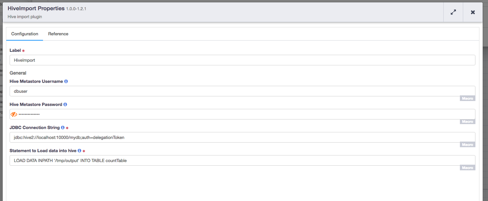

[](https://travis-ci.org/hydrator/hive-plugins) [](https://opensource.org/licenses/Apache-2.0)

Hive Import
===========

Hive Import Action executes a hive load statement which loads data from HDFS directory/file location into a hive table.



Usage Notes
-----------

Hive Import Action imports data from HDFS by executing provided Hive [Load Statement](https://cwiki.apache.org/confluence/display/Hive/GettingStarted). 
Local file storage is not allowed because a pipeline can run on any machine. If `LOCAL` file storage option is provided,
pipeline deployment fails at publish time. Hive Import only accepts hive `LOAD` statements. If any other hive query is provided,
pipeline publish will fail. 

If the Load command is executed successfully, all the files in the directory will be moved, not copied, to hive/warehouse directory. Hive import works with Hive 1.2.1.

Plugin Configuration
---------------------

| Configuration | Required | Default | Description |
| :------------ | :------: | :----- | :---------- |
| **Hive Metastore Username** | **N** | N/A | User identity for connecting to the specified hive database. Required for databases that need authentication. Optional for databases that do not require authentication. |
| **Hive Metastore Password** | **N** | N/A | Password to use to connect to the specified database. Required for databases that need authentication. Optional for databases that do not require authentication. |
| **JDBC Connection String** | **Y** | N/A | JDBC connection string including database name. Please use auth=delegationToken, CDAP platform will provide appropriate delegation token while running the pipeline. |
| **Statement to Load data into hive** | **Y** | N/A | Load command to load files data into a hive table. `LOCAL` option in `LOAD` command is not available. |

Build
-----
To build this plugin:

```
   mvn clean package
```    

The build will create a .jar and .json file under the ``target`` directory.
These files can be used to deploy your plugins.

Deployment
----------
You can deploy your plugins using the CDAP CLI:

    > load artifact <target/hive-plugins-<version>.jar config-file <target/hive-plugins<version>.json>

For example, if your artifact is named 'hive-plugins-<version>':

    > load artifact target/hive-plugins-<version>.jar config-file target/hive-plugins-<version>.json
    
## Mailing Lists

CDAP User Group and Development Discussions:

* `cdap-user@googlegroups.com <https://groups.google.com/d/forum/cdap-user>`

The *cdap-user* mailing list is primarily for users using the product to develop
applications or building plugins for appplications. You can expect questions from 
users, release announcements, and any other discussions that we think will be helpful 
to the users.


## License and Trademarks

Copyright © 2017 Cask Data, Inc.

Licensed under the Apache License, Version 2.0 (the "License"); you may not use this file except
in compliance with the License. You may obtain a copy of the License at

http://www.apache.org/licenses/LICENSE-2.0

Unless required by applicable law or agreed to in writing, software distributed under the 
License is distributed on an "AS IS" BASIS, WITHOUT WARRANTIES OR CONDITIONS OF ANY KIND, 
either express or implied. See the License for the specific language governing permissions 
and limitations under the License.

Cask is a trademark of Cask Data, Inc. All rights reserved.

Apache, Apache HBase, and HBase are trademarks of The Apache Software Foundation. Used with
permission. No endorsement by The Apache Software Foundation is implied by the use of these marks.      
